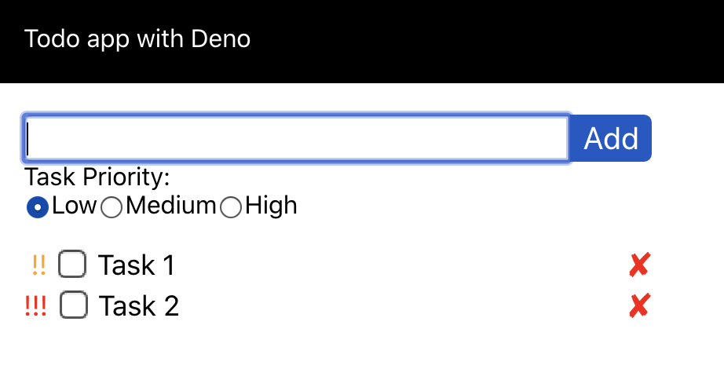

# Deno todo app:

- This is an attempt to create and app and REST Api with Deno using `oak`.

Read about Deno:

- _Manual_: https://deno.land/manual
- _v1.0.0_: https://deno.land/v1

# Server
The server code's entry point is `./index.ts`. It  is very basic server created using deno. It starts on port `4000` by default.

# Client
Create react app is used to create the application for front end. Here is how it looks

# Docker
This source has docker file included. To build and create container, use following command

`docker-compose build && docker-compose up deno`

# Setup

- Install Deno
- Fork this repository and navigate to it.
- Client code is in `client` folder
- Start the deno server using `deno run --allow-env --allow-net --allow-read --allow-write index.ts`
- To run or work on client code, navigate to the client folder and use `npm start` command.

Feel free to fork and look around the code.
